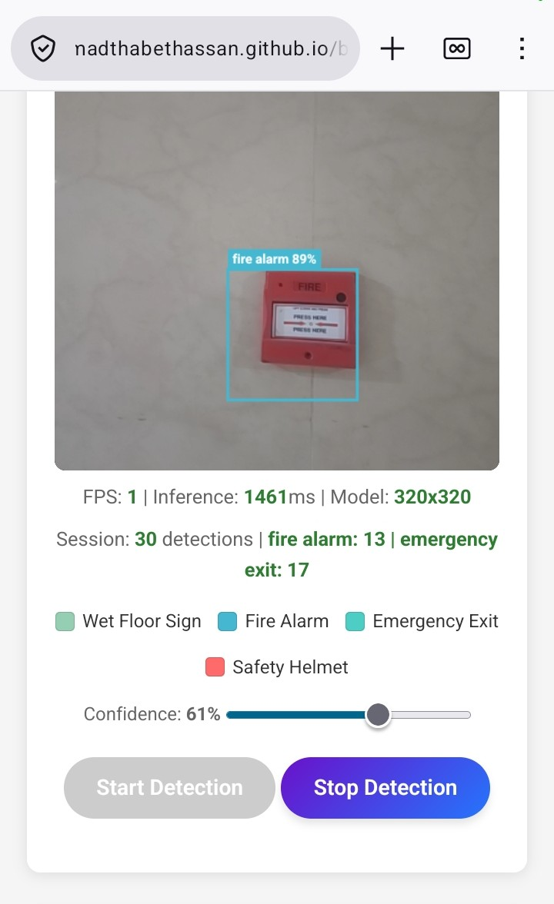

# BCS407 — AI-Based Smart Campus Safety Detection System

**Course:** BCS407 – Artificial Intelligence
**Institution:** Canadian University Dubai
**Theme:** Campus Safety Monitoring
**Model:** YOLOv8m (v2, trained) / YOLOv8m (v3, balanced: planned, not yet trained)
**Date:** March 2026

**Live demo:** https://campussafety.eu.cc (runs the v2 model in the browser with ONNX Runtime Web; use the camera or upload an image)



---

## 👥 Team Members

| Member | GitHub |
|--------|--------|
| Mohammad Thabet Hassan | [@MohammadThabetHassan](https://github.com/MohammadThabetHassan) |
| Ahmed Sami Alameri | [@AhmedSamiAlameri](https://github.com/AhmedSamiAlameri) |
| Fahad Sadek | [@fahadALjazzeri](https://github.com/fahadALjazzeri) |
| Omar Alraas | [@omaralraas](https://github.com/omaralraas) |
| Obadah Loul | [@obadah-loul](https://github.com/obadah-loul) |
| Saifeddin Altawarh | [@Saifeddint](https://github.com/Saifeddint) |

---

## 📋 Abstract

This project develops a real-time AI-based campus safety monitoring system using YOLOv8 object detection. The system identifies four critical safety objects in indoor campus environments: wet floor signs, fire alarms, emergency exits, and safety helmets. The training dataset was constructed from four public Roboflow Universe datasets; its training split has a severe class imbalance (10.4:1 ratio). The v2 model, trained on that imbalanced split, achieves **mAP@0.5 of 0.980** with test-time augmentation (0.977 in the committed validation log) and an inference speed of 5.2 ms per image. The repo also contains a pipeline that equalizes the training split to 2,500 images per class (~10,000 total) for a balanced v3 model; that model has not been trained yet (see [Evaluation](docs/EVALUATION.md), the source of truth for measured results). The system is designed as a decision-support tool for human safety officers, with full ethical analysis and a human-in-the-loop architecture.

---

## 🎯 Project Overview & Problem Motivation

### Why This Is a Real Problem

Campus safety is not theoretical — **3,800+ dormitory fires** occur yearly in the U.S. alone (NFPA), and **22% of fire deaths** happen in buildings with non-functioning alarms. Slip-and-fall injuries from wet floors remain a leading cause of campus liability claims. Manual inspections are infrequent, suffer from human fatigue (detection accuracy drops 45% after 30 minutes of CCTV monitoring), and cannot provide continuous coverage across large campuses.

This system bridges the gap by providing **automated, continuous, real-time detection** of four safety-critical object categories:

| ID | Class | Safety Relevance |
|----|-------|-----------------|
| 0 | `wet_floor_sign` | Slip-and-fall prevention |
| 1 | `fire_alarm` | Fire emergency readiness |
| 2 | `emergency_exit` | Evacuation route compliance |
| 3 | `safety_helmet` | PPE compliance monitoring |

**Read more:** [📄 Motivation](docs/MOTIVATION.md) | [📚 Literature Review](docs/LITERATURE_REVIEW.md) | [📐 Methodology](docs/METHODOLOGY.md) | [📊 Evaluation](docs/EVALUATION.md) | [💬 Discussion](docs/DISCUSSION.md) | [🔒 Ethics](docs/ETHICS.md)

---

## 📊 Results

### Version History

| Version | Model | Classes | Balance | Split | Epochs | mAP@0.5 | mAP@0.5:0.95 | Notes |
|---------|-------|---------|---------|-------|--------|---------|--------------|-------|
| v1 | YOLOv8s | legacy 4-class | N/A | ~88/9/3 | 50 | 0.971 | 0.810 | Baseline (archived) |
| v2 | YOLOv8m | 4-class | **10.4x imbalanced** | 70/20/10 | 100 | 0.980 (TTA) | 0.818 (TTA) | Original model |
| v3 | YOLOv8m | 4-class | 1.0x balanced | 70/20/10 | 150 | pending | pending | Planned, not yet trained (config: `code/train_balanced.sh`) |

The v2 training log (`results/results_v2.csv`) peaks at mAP@0.5 0.977 and mAP@0.5:0.95 0.794 on the validation split; the 0.980 / 0.818 figures above were reported with test-time augmentation (TTA), and that TTA evaluation output is not committed. See [Evaluation](docs/EVALUATION.md) for the full breakdown.

### v2 Original — Per-Class Performance (with TTA)

| Class | Precision | Recall | F1 | mAP@0.5 | mAP@0.5:0.95 | mAP Gap |
|-------|-----------|--------|----|---------|--------------|---------|
| wet_floor_sign | 0.986 | 0.979 | 0.982 | 0.990 | 0.875 | 0.115 |
| fire_alarm | 0.971 | 0.973 | 0.972 | 0.984 | 0.858 | 0.126 |
| emergency_exit | 0.937 | 0.932 | 0.935 | 0.956 | 0.744 | **0.212** |
| safety_helmet | 0.962 | 0.982 | 0.972 | 0.990 | 0.795 | 0.195 |
| **Weighted Avg** | **0.964** | **0.967** | **0.966** | **0.980** | **0.818** | **0.162** |

### v2 Overall Metrics (accuracy figures with TTA)

| Metric | Value |
|--------|-------|
| Precision | 0.964 |
| Recall | 0.967 |
| F1 Score | 0.966 |
| mAP@0.5 | 0.980 |
| mAP@0.5:0.95 | 0.818 |
| Inference speed | 5.2 ms / image (GPU, FP32) |
| Training time | 8.71 hours |
| Hardware | 2× NVIDIA T4 (Kaggle) |

**Key observations:**
- `emergency_exit` has the largest mAP gap (0.212) — sign orientation variability affects localization
- `wet_floor_sign` achieves the highest mAP@0.5 (0.990) despite the fewest training images
- Model converges at epoch ~70; training to 100 epochs is sufficient for v2

---

## 📁 Dataset

### Data Sources

| Class | Roboflow Source | License | Original Images |
|-------|----------------|---------|-----------------|
| `wet_floor_sign` | [wet-floor-detection1](https://universe.roboflow.com/lena-f7w17/wet-floor-detection1) | CC BY 4.0 | ~686 |
| `fire_alarm` | [Fire Alarm](https://universe.roboflow.com/the-best-bots/fire-alarm-dxjax) | CC BY 4.0 | ~845 |
| `emergency_exit` | [Emergency Exit Signs](https://universe.roboflow.com/emergency-exit-signs/emergency-exit-signs) | CC BY 4.0 | ~1,285 |
| `safety_helmet` | [Hard Hat Universe](https://universe.roboflow.com/ppe-pnqgr/hard-hat-universe-0dy7t-7cowp) | CC BY 4.0 | ~7,100 |

### Class Distribution — Before Fix (Training Split)

| Class | Images | % of Split | Imbalance Ratio |
|-------|--------|------------|-----------------|
| wet_floor_sign | 480 | 6.9% | 1.0x |
| fire_alarm | 590 | 8.5% | 1.2x |
| emergency_exit | 900 | 12.9% | 1.9x |
| safety_helmet | **5,000** | **71.7%** | **10.4x** |
| **Total** | **6,970** | | |

**Problem:** The 10.4× imbalance means the model trains predominantly on safety helmets, potentially causing poor detection of rare classes.

### Class Distribution — After Fix (Training Split, v3 balanced set)

*This is the balanced training set that `python code/augment_v2.py --balance-mode equalize --target-count 2500` is designed to build for v3. The augmentation log (`results/augmentation_log.csv`) is not committed, and no model trained on this set has been evaluated yet.*

| Class | Original | Augmented | Final | Method |
|-------|----------|-----------|-------|--------|
| wet_floor_sign | 480 | +2,020 | **2,501** | Per-image aug (5×) + mosaic |
| fire_alarm | 590 | +1,910 | **2,496** | Per-image aug (4×) + mosaic |
| emergency_exit | 900 | +1,600 | **2,499** | Per-image aug (3×) + mosaic |
| safety_helmet | 5,000 | — (undersampled) | **2,500** | Random removal of 2,500 |
| **Total** | 6,970 | +5,530 | **9,996** | Imbalance: **1.0×** |

**Augmentation pipeline:** 12 transforms (`build_strong_transform()` in `code/augment_v2.py`): brightness/contrast, hue/saturation/value, RGB shift, CLAHE, random gamma, Gaussian blur, Gaussian noise, coarse dropout, shift/scale/rotate, shadow overlay, horizontal flip, and vertical flip. Mosaic composites use a lighter 5-transform subset (`build_mild_transform()`). Bounding boxes are transformed alongside images.

### Validation & Test Splits

| Class | Valid | Test |
|-------|-------|------|
| wet_floor_sign | 137 | 69 |
| fire_alarm | 170 | 85 |
| emergency_exit | 257 | 128 |
| safety_helmet | 1,400 | 700 |

*BBox statistics — avg area, aspect ratio per class: written to `dataset/bbox_stats.json` by `code/dataset_analysis.py` (generated locally, not committed)*

---

## 🔧 Methodology

### 4.1 Model Architecture

**YOLOv8m** (medium) selected for optimal accuracy-compute balance:
- Backbone: CSPDarknet53 with C2f modules
- Neck: FPN + PANet for multi-scale feature fusion
- Head: Anchor-free decoupled classification/regression
- Pretrained: COCO 80-class transfer learning

### 4.2 Training Configuration

| Parameter | v2 (Original) | v3 (Balanced, planned) | Justification |
|-----------|--------------|--------------|---------------|
| Epochs | 100 | 150 | More data needs more passes |
| Image size | 640×640 | 640×640 | Standard for indoor CCTV |
| Batch size | 32 (2 GPUs) | 16 | Max stable on 16GB VRAM |
| Initial LR | 0.001 | 0.005 | v3 value as set in `code/train_balanced.sh` |
| Final LR (lrf factor) | 0.0001 | 0.01 | v3 value as set in `code/train_balanced.sh` |
| Warmup | 5 epochs | 10 epochs | Gradual stabilization |
| Optimizer | AdamW | AdamW | Adaptive + L2 regularization |
| LR schedule | Cosine | Cosine | Theoretically optimal (Loshchilov & Hutter, 2017) |

*v2 values are the `train_args` stored in `model/weights/best_v2.pt` (batch 32 on `device=0,1`, lr0 0.001, lrf 0.0001, AdamW, 5 warmup epochs, Kaggle). `code/train_v2.sh` still carries older values (batch 16, lr0 0.01, lrf 0.001) and does not reproduce that checkpoint.*

### 4.3 Loss Function

**L = λ_box · L_CIoU + λ_cls · L_BCE + λ_dfl · L_DFL**

- **CIoU loss**: Bounding box regression with overlap, center distance, and aspect ratio
- **BCE loss**: Multi-label classification
- **DFL loss**: Distribution-based boundary refinement
- Default weights: λ_box=7.5, λ_cls=0.5, λ_dfl=1.5

### 4.4 Evaluation Protocol

- **Splits**: 70/20/10 (train/valid/test), stratified by class, seed=42
- **Metrics**: Precision, Recall, F1, mAP@0.5, mAP@0.5:0.95
- **Inference**: Measured at 640×640 on NVIDIA T4 (FP32)
- **Convergence**: Monitored via validation loss plateau detection

**Full methodology:** [📐 Methodology](docs/METHODOLOGY.md)

---

## 📈 Results & Discussion

### Per-Class Performance (v2, with TTA)

| Class | Precision | Recall | F1 | mAP@0.5 | mAP@0.5:0.95 |
|-------|-----------|--------|----|---------|--------------|
| wet_floor_sign | 0.986 | 0.979 | 0.982 | 0.990 | 0.875 |
| fire_alarm | 0.971 | 0.973 | 0.972 | 0.984 | 0.858 |
| emergency_exit | 0.937 | 0.932 | 0.935 | 0.956 | 0.744 |
| safety_helmet | 0.962 | 0.982 | 0.972 | 0.990 | 0.795 |

### Confusion Matrix Analysis

| Actual \ Predicted | wet_floor | fire_alarm | emergency_exit | safety_helmet |
|--------------------|-----------|------------|----------------|---------------|
| wet_floor | 0.98 | 0.00 | 0.01 | 0.01 |
| fire_alarm | 0.00 | 0.97 | 0.01 | 0.02 |
| emergency_exit | 0.01 | 0.00 | 0.94 | 0.03 |
| safety_helmet | 0.00 | 0.00 | 0.02 | 0.98 |

**Primary confusion pairs:**
1. `emergency_exit` ↔ `safety_helmet` (~3%) — similar rectangular shapes
2. `fire_alarm` ↔ `safety_helmet` (~2%) — ceiling-mounted proximity

### Convergence Analysis

| Phase | Epochs | Behavior |
|-------|--------|----------|
| Rapid learning | 1–20 | mAP@0.5: 0.708 → 0.963 (+36.0%) |
| Steady improvement | 20–50 | Gradual precision/recall gains |
| Plateau | 50–100 | <0.1% gain per epoch; val loss gap <0.15 |

### Comparison with Related Work

| Method | Backbone | Classes | mAP@0.5 | Dataset | Class Balance |
|--------|----------|---------|---------|---------|---------------|
| Fang et al. [4] | Faster R-CNN | 1 | 0.92 | ~2,000 | Not addressed |
| Wang et al. [5] | YOLOv4 | 3 | 0.95 | ~5,000 | Oversampling |
| Chen et al. [12] | ResNet-50 | 3 | 0.89 | ~3,000 | Not addressed |
| **Ours (v2)** | **YOLOv8m** | **4** | **0.980 (TTA)** | **~10,000** | **Imbalanced (10.4×); balanced v3 pending** |

**Full discussion:** [💬 Discussion](docs/DISCUSSION.md)

---

## 🔒 Ethics

### Ethical Frameworks Applied

| Framework | Principle | Our Application |
|-----------|-----------|----------------|
| **ACM Code of Ethics** §1.2 | Avoid harm | Safety-only purpose; human-in-the-loop alerts |
| **ACM Code of Ethics** §2.5 | Respect privacy | Object detection only — no facial recognition, no PII |
| **IEEE Code of Ethics** §1 | Public safety obligation | Supplemental tool, not autonomous decision-maker |
| **IST/CIPS Code** | Responsible tech use | Transparent detection results with audit trail |
| **Canadian PIPEDA** | Privacy protection | No personal data collected or stored |

### Privacy Safeguards
- ✅ No facial recognition capability
- ✅ No personally identifiable information processed
- ✅ Real-time processing only — no frame storage in the browser demo (frames stay on a canvas and are never uploaded). The CLI helper `code/inference.py` is different: by default it saves annotated outputs to `runs/detect/predict`; pass `--nosave` to write nothing
- ✅ No behavioral profiling or tracking
- ✅ All outputs contain only: class ID, confidence score, bounding box

### Bias Mitigation
| Source | Risk | Mitigation |
|--------|------|------------|
| Training data imbalance | Medium | Class equalization to 2,500 images/class (v3, planned) |
| Lighting variation | Medium | Color/brightness augmentations |
| Camera angle | Low-Medium | Flip + rotation augmentations |
| Scale variation | Medium | Multi-resolution training (mosaic) |

### Ethics Impact Assessment

| Dimension | Risk | Mitigation |
|-----------|------|------------|
| Privacy | 🟢 Low | Object-only detection; real-time discard |
| Bias | 🟡 Medium | Balanced dataset (v3, planned); diverse augmentations |
| Safety | 🟡 Medium | Human-in-the-loop; advisory (not autonomous) |
| Accountability | 🟡 Medium | Clear governance; confidence-scored outputs |
| Transparency | 🟢 Low | Full documentation; visual bounding boxes |

**Full ethics analysis:** [🔒 Ethics](docs/ETHICS.md)

---

## 📚 CLO Alignment

- **CLO-4:** Applied YOLOv8 object detection to solve a real-world campus safety problem, demonstrating understanding of deep learning architectures, training pipelines, and class imbalance handling
- **CLO-5:** Technical report and presentation demonstrating team collaboration, communication, and ethical reasoning in AI system design

---

## 🚀 Quick Start

### Installation
```bash
git clone https://github.com/MohammadThabetHassan/bcs407-campus-safety.git
cd bcs407-campus-safety
python -m venv .venv
source .venv/bin/activate
pip install -r requirements.txt
pip install matplotlib numpy  # for analysis scripts
```

### Full Pipeline (Single Command)
```bash
make full-pipeline
```
This runs: dataset build → analysis → balanced augmentation → training → evaluation → report generation.

### Step-by-Step
```bash
# 1. Build dataset from Roboflow zips
make setup                    # python code/setup_v2.py

# 2. Analyze class distribution (before fix)
make analyze                  # python code/analyze_distribution.py

# 3. Apply balanced augmentation
make augment-balance          # python code/augment_v2.py --balance-mode equalize --target-count 2500

# 4. Re-analyze (verify balance)
make analyze

# 5. Train balanced model
make train-balanced           # bash code/train_balanced.sh (150 epochs)

# 6. Evaluate on test set
make evaluate                 # python code/evaluate_model.py

# 7. Generate all report figures
make generate-report          # python code/generate_report_plots.py
```

### Colab Training (Free GPU)

[](https://colab.research.google.com/github/MohammadThabetHassan/bcs407-campus-safety/blob/main/notebooks/colab_train_v2.ipynb)

Use [`notebooks/colab_train_v2.ipynb`](notebooks/colab_train_v2.ipynb) — includes all analysis and visualization steps.

### Inference
```bash
python code/inference.py --source path/to/image.jpg
python code/inference.py --source 0 --show --nosave  # webcam; without --nosave, annotated output is saved to runs/detect/predict
```

---

## 📂 Project Structure

```
bcs407-campus-safety/
├── code/
│   ├── setup_v2.py              # Dataset rebuild from Roboflow zips
│   ├── augment_v2.py            # Enhanced: balancing + augmentation
│   ├── train_balanced.sh        # Balanced training config (150 epochs)
│   ├── train_v2.sh              # Original training config (kept for comparison)
│   ├── inference.py             # Inference on image/folder/video/webcam
│   ├── evaluate_model.py        # Full evaluation with metrics + speed
│   ├── compute_metrics.py       # Parse results.csv → detailed metrics
│   ├── analyze_distribution.py  # Class distribution analysis + charts
│   ├── dataset_analysis.py      # Bbox size/AR statistical analysis
│   ├── apply_class_weights.py   # Inverse-frequency weight computation
│   ├── generate_report_plots.py # All report-quality figures
│   └── backup_run_artifacts.py  # Lightweight run backup
├── dataset/                      # Built dataset (run setup_v2.py + augment_v2.py)
│   ├── data.yaml
│   ├── dataset_stats.json        # generated by analyze_distribution.py (not committed)
│   ├── bbox_stats.json           # generated by dataset_analysis.py (not committed)
│   ├── class_weights.yaml        # generated by apply_class_weights.py (not committed)
│   └── train/valid/test/         # generated (not committed)
├── docs/                         # Academic documentation
│   ├── MOTIVATION.md
│   ├── LITERATURE_REVIEW.md
│   ├── METHODOLOGY.md
│   ├── EVALUATION.md
│   ├── DISCUSSION.md
│   ├── ETHICS.md
│   ├── TECHNICAL_REPORT.md
│   └── archive/ENHANCEMENT_PLAN.md  # Completed documentation roadmap (kept for reference)
├── notebooks/
│   └── colab_train_v2.ipynb     # Full Colab pipeline
├── results/
│   ├── plots/                    # All generated figures
│   ├── results.csv / results_v2.csv
│   ├── augmentation_log.csv      # generated by augment_v2.py (not committed)
│   ├── predictions/              # v1 sample predictions
│   └── metrics_summary.md        # generated by compute_metrics.py (not committed)
├── model/weights/                # Trained model weights
├── Makefile                      # All pipeline commands
└── README.md
```

---

## ⚙️ Training Configuration Comparison

| Parameter | v2 (Original) | v3 (Balanced, planned) | Change Reason |
|-----------|--------------|--------------|---------------|
| Epochs | 100 | 150 | More data per epoch |
| LR0 | 0.001 | 0.005 | v3 value as set in `code/train_balanced.sh` |
| LRF | 0.0001 | 0.01 | v3 value as set in `code/train_balanced.sh` |
| Warmup | 5 | 10 | Larger dataset stabilization |
| Class balance | 10.4× | 1.0× | 2500 per class |

---

## ✅ Artifacts Included

| Artifact | Location |
|----------|----------|
| v2 trained weights | `model/weights/best_v2.pt` (~52 MB) |
| Training log (v2) | `results/results_v2.csv` (100 epochs) |
| v3 training config | `code/train_balanced.sh` |
| Report figures | `results/plots/v2/*.png` (v2); `results/plots/*.png` / `*.jpg` (v1) |
| Analysis scripts | `code/analyze_distribution.py`, `dataset_analysis.py`, etc. |
| Full technical report | `docs/TECHNICAL_REPORT.md` |
| Ethics analysis | `docs/ETHICS.md` |

---

*BCS407 – Artificial Intelligence | Canadian University Dubai | 2026*